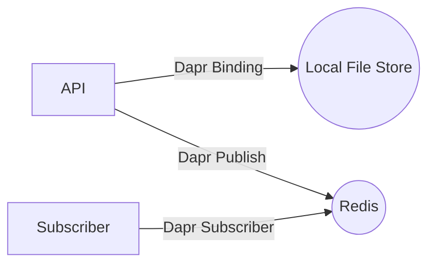
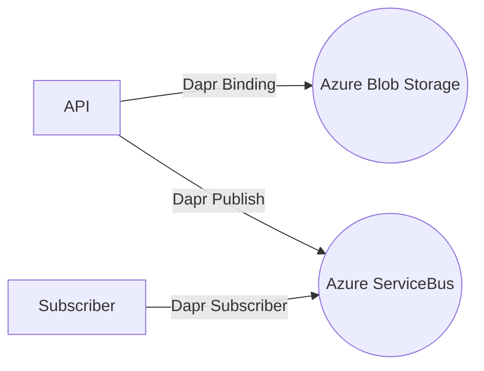

# daz
This project is a demo project for Azure Container Apps. It is a simple api that uses [Dapr](https://dapr.io/) to bind to a local file store and redis when running locally and to Azure Blob Storage and Azure ServiceBus  when running in Azure.

## Architecture
The are two sets of architecture diagrams, one for running locally and one for running in Azure.

### Local architecture



### Azure architecture




## Running locally
This project is using [tye](https://github.com/dotnet/tye) to run locally.
Use the following command to run the project locally:

```bash
 tye run --dashboard  
```

This will start the project and open the dashboard in your browser.

## Running in Azure
First create resources in Azure using the following commands:

1. Create a resource group

```bash
rg='rg-daz'
loc='westeurope'
acaEnv='dazenv'
az group create --name $rg --location $loc
```
2. Create the rest of the resources - this will take a while to complete as it creates the necessary resources and deploys the code to Azure Container Apps (ACA) and azure container registry (ACR)

```bash
 az deployment group create \
  --resource-group $rg \
  --template-file ./main.bicep \
  --parameters environment_name=$acaEnvc
```