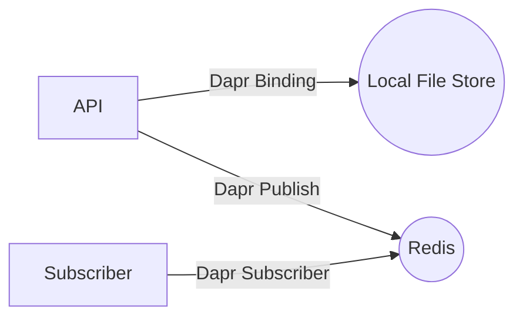
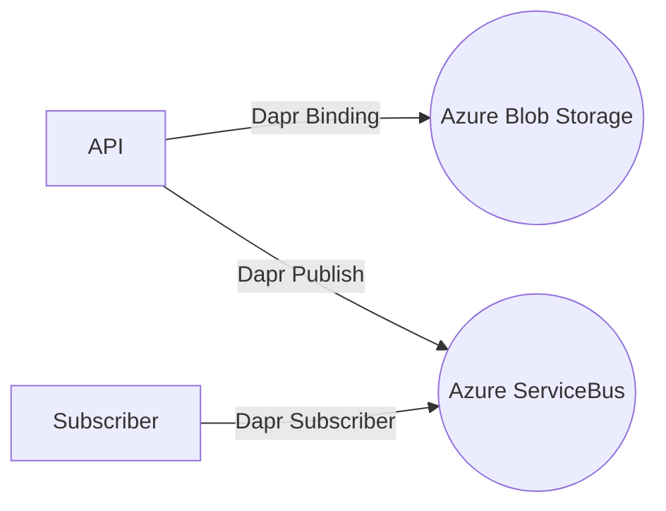

# daz
This project is a demo project for Azure Container Apps. It is a simple api that uses [Dapr](https://dapr.io/) to bind to a local file store and redis when running locally and to Azure Blob Storage and Azure ServiceBus  when running in Azure.

## Architecture
The are two sets of architecture diagrams, one for running locally and one for running in Azure.

### Create Api project 
```powershell
dotnet new webapi -o Daz.Backend.Api
```

* containerize this application, so we can push it to Azure Container Registry as a docker image then deploy it to Azure Container Apps. Start by opening the VS Code Command Palette (Ctrl+Shift+P) and select Docker: Add Docker Files to Workspace...

* Use .NET: ASP.NET Core when prompted for application platform.
* Choose Linux when prompted to choose the operating system.
* You will be asked if you want to add Docker Compose files. Select No.

>[!NOTE] 
>Take a note of the provided application port as we will pass it later on as the --target-port for the az containerapp create command.

Dockerfile and .dockerignore files are added to the workspace.

## Azure Infrastrcture as CLI
1. Upgrade Azure CLI
```powershell	
az upgrade
```
2.  Login to Azure
```powershell	
az login 
```
3.  Only required if you have multiple subscriptions
```powershell	
az account set --subscription <name or id>
```
4. Install/Upgrade Azure Container Apps Extension
```powershell	
az extension add --name containerapp --upgrade
```

5. Set variables
```powershell
$RESOURCE_GROUP="rg-daz"
$LOCATION="northeurope"
$ENVIRONMENT="daz-containerapps-env"
$WORKSPACE_NAME="daz-logs" #b<replace this with your unique app log analytics workspace name>
$APPINSIGHTS_NAME="daz-appinsights" # <replace this with your unique app insights name>
$BACKEND_API_NAME="daz-backend-api"
$ACR_NAME="dazm47acr" # <replace this with your unique acr name>
```
6. Create Resource Group
```powershell
az group create --name $RESOURCE_GROUP --location "$LOCATION"
```

7. Create Azure Container Registry (ACR) - set the admin-enabled flag to true in order to seamlessly authenticate the Azure container app when trying to create the container app using the image stored in ACR
```powershell
az acr create --resource-group $RESOURCE_GROUP --name $ACR_NAME --sku Basic --admin-enabled true
```

8. Create Log Analytics Workspace
```powershell
# create the log analytics workspace
az monitor log-analytics workspace create --resource-group $RESOURCE_GROUP --workspace-name $WORKSPACE_NAME

# retrieve workspace ID
$WORKSPACE_ID=az monitor log-analytics workspace show --query customerId -g $RESOURCE_GROUP -n $WORKSPACE_NAME -o tsv

# retrieve workspace secret
$WORKSPACE_SECRET=az monitor log-analytics workspace get-shared-keys --query primarySharedKey -g $RESOURCE_GROUP -n $WORKSPACE_NAME -o tsv
```
9. Create application insights
```powershell
# Install the application-insights extension for the CLI
az extension add -n application-insights

# Create application-insights instance
az monitor app-insights component create -g $RESOURCE_GROUP -l $LOCATION --app $APPINSIGHTS_NAME --workspace $WORKSPACE_NAME

# Get Application Insights Instrumentation Key
$APPINSIGHTS_INSTRUMENTATIONKEY=($(az monitor app-insights component show --app $APPINSIGHTS_NAME -g $RESOURCE_GROUP)  | ConvertFrom-Json).instrumentationKey
```
10. create Azure Container Apps environment
```powershell
# Create the ACA environment
az containerapp env create --name $ENVIRONMENT --resource-group $RESOURCE_GROUP --logs-workspace-id $WORKSPACE_ID --logs-workspace-key $WORKSPACE_SECRET --dapr-instrumentation-key $APPINSIGHTS_INSTRUMENTATIONKEY --location $LOCATION
```

11. Build and push the docker image to ACR
```powershell
az acr build --registry $ACR_NAME --image "daz/$BACKEND_API_NAME" --file 'Daz.Backend.Api/Dockerfile' .
```

12. Create Azure Container App
```powershell
az containerapp create --name $BACKEND_API_NAME  --resource-group $RESOURCE_GROUP --environment $ENVIRONMENT --image "$ACR_NAME.azurecr.io/daz/$BACKEND_API_NAME" --registry-server "$ACR_NAME.azurecr.io" --target-port 5130 --ingress 'external' --min-replicas 1 --max-replicas 3 --cpu 0.25 --memory 0.5Gi --query configuration.ingress.fqdn
```

13.  Use Azure Cosmos DB with Dapr State Store Management API
```powershell
$COSMOS_DB_ACCOUNT="dazcosmosdb" # "<choose a unique cosmos db account name e.g. taskstracker-state-store-your initials here>" 
$COSMOS_DB_DBNAME="dazdb" 
$COSMOS_DB_CONTAINER="filescollection" 
```

14. Check if Cosmos account name already exists globally
```powershell
az cosmosdb check-name-exists --name $COSMOS_DB_ACCOUNT
```
if it returns false continue with the next command 
else try a new unique name

15. Create a Cosmos account for SQL API
```powershell	
az cosmosdb create --name $COSMOS_DB_ACCOUNT --resource-group $RESOURCE_GROUP
```
16.  Create a SQL API database
```powershell	
az cosmosdb sql database create --account-name $COSMOS_DB_ACCOUNT --resource-group $RESOURCE_GROUP --name $COSMOS_DB_DBNAME
```
17.  Create a SQL API container
```powershell	
az cosmosdb sql container create --account-name $COSMOS_DB_ACCOUNT --resource-group $RESOURCE_GROUP --database-name $COSMOS_DB_DBNAME --name $COSMOS_DB_CONTAINER --partition-key-path "/id" --throughput 400
```

18. List the connection strings for the Cosmos DB account
```powershell
## List Azure CosmosDB keys
az cosmosdb keys list --name $COSMOS_DB_ACCOUNT --resource-group $RESOURCE_GROUP
```

19. create storage
```powershell
$STORAGE_ACCOUNT_NAME = "dazstorage"

az storage account create --name $STORAGE_ACCOUNT_NAME --resource-group $RESOURCE_GROUP --location $LOCATION --sku Standard_LRS --kind StorageV2

# list azure storage keys
az storage account keys list -g $RESOURCE_GROUP -n $STORAGE_ACCOUNT_NAME
```

### Local architecture



### Azure architecture




## Running locally
This project is using [tye](https://github.com/dotnet/tye) to run locally.
Use the following command to run the project locally:

```bash
 tye run --dashboard  
```

This will start the project and open the dashboard in your browser.

## Running in Azure
First create resources in Azure using the following commands:

1. Create a resource group

```bash
rg='rg-daz'
loc='westeurope'
acaEnv='dazenv'
az group create --name $rg --location $loc
```
2. Create the rest of the resources - this will take a while to complete as it creates the necessary resources and deploys the code to Azure Container Apps (ACA) and azure container registry (ACR)

```bash
 az deployment group create \
  --resource-group $rg \
  --template-file ./main.bicep \
  --parameters environment_name=$acaEnvc
```